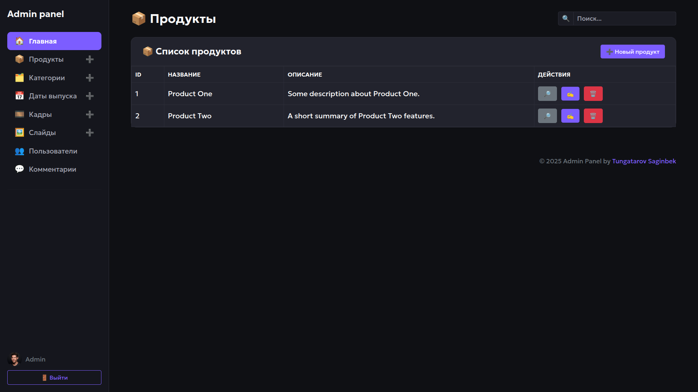
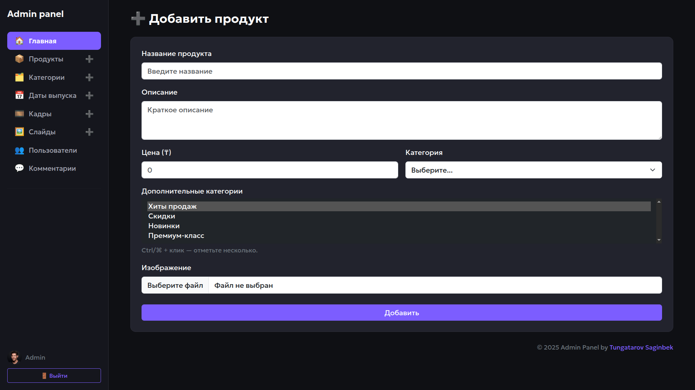
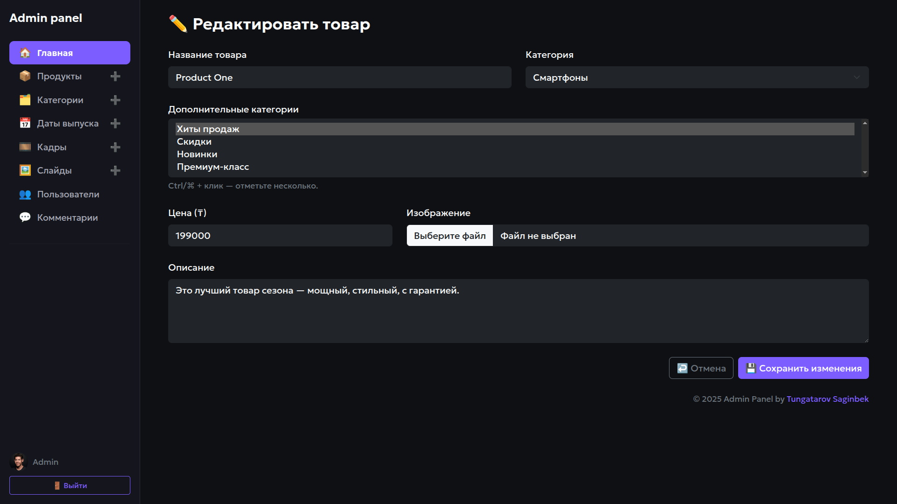
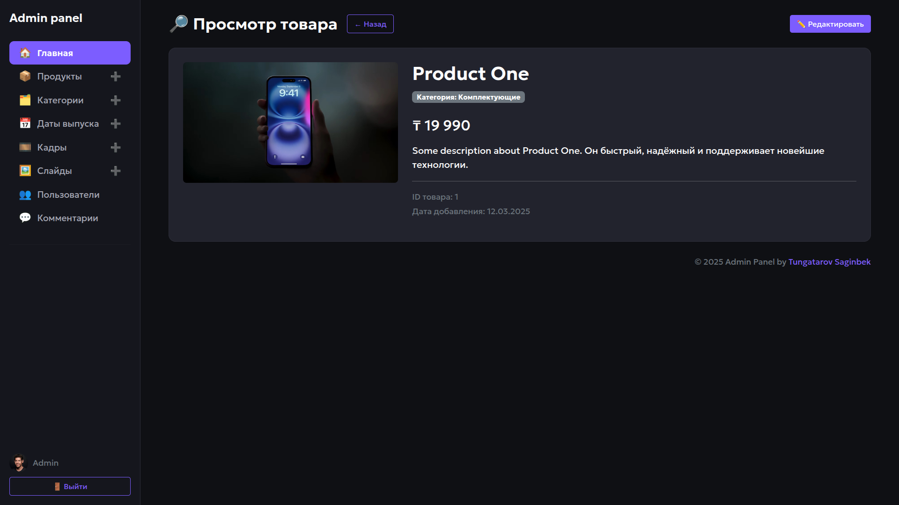
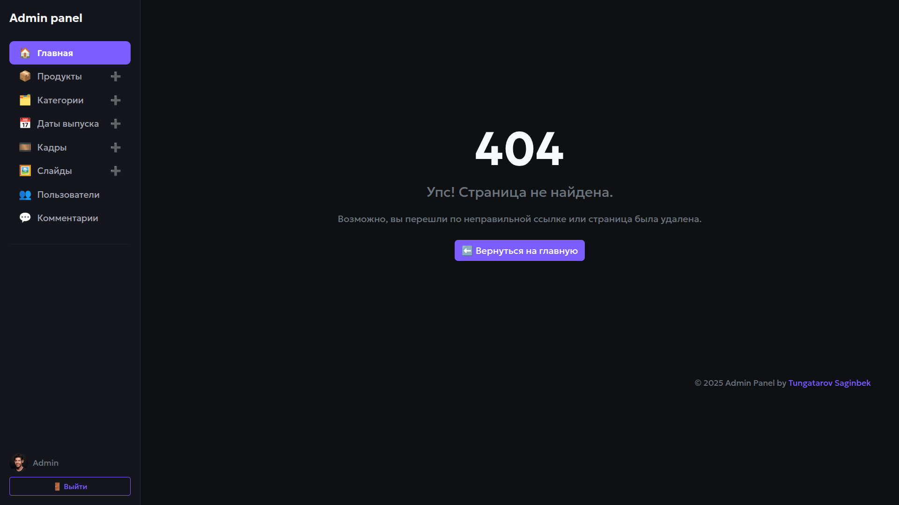

# Dark Admin  

> Готовая тёмная админ-панель на **Bootstrap 5** — простая, лёгкая, но при этом достаточно функциональная, чтобы стать отправной точкой для любого проекта.

---

## 📌 О проекте  

* **Цель:** быстро собрать «скелет» админки, который можно сразу подключать к back-end или использовать как статический прототип.  
* **Подходит для:** интернет-магазинов, внутренних CRM, дашбордов аналитики и любых приложений, где нужна базовая панель управления.  

---

## 🚀 Реализовано

| Блок / экран                              | Кратко                                                                       |
|-------------------------------------------|------------------------------------------------------------------------------|
| **Главная (Dashboard)**                   | Карточки с ключевыми метриками, график Chart.js, последние комментарии.      |
| **CRUD «Продукты»**                       | Страницы: список, создание, просмотр, редактирование.                        |
| **Мультикатегории**                       | Поддержка основной и дополнительной категории (multi-select).                |
| **Кастомная тёмная тема**                 | CSS-переменные, плавные ховеры, адаптивный сайдбар.                           |
| **404**                                   | Страница ошибки в общем стиле проекта.                                       |
| **Mobile-friendly**                       | Кнопка ☰ + ✖ для открытия/закрытия меню на телефоне.                          |

### Как распределялась работа  

| Кем | Вклад |
|-----|-------|
| **Я** | разметка страниц, вся кастомная стилизация, логика мобильного меню, подключение Chart.js, формы и валидация, структура репозитория, README. |
| **AI-помощник** | подсказки по улучшению UX, генерация черновых HTML-фрагментов и примеров данных. |

Таким образом основная работа — дизайн, верстка и интеграция компонентов — выполнена вручную, а ИИ использовался точечно для ускорения рутинных задач.

---

## 🛠️ Стек

- **Bootstrap 5** (Grid, Offcanvas, Utilities)  
- **Chart.js 4** (линейный график)  
- **Google Fonts — Geologica**  
- Чистый **HTML / CSS / JS** без сборщика

---

## ⚙️ Быстрый старт

```bash
git clone https://github.com/TungatarovSaginbekBerikuly/dark-admin-bootstrap5.git
cd dark-admin-bootstrap5
# проект статический — достаточно открыть файл
open index.html   # или двойной клик

---

## 📸 Скриншоты

| Dashboard | Список продуктов |
|-----------|-----------------|
|  |  |

<details>
<summary>Дополнительные</summary>

| Создание | Редактирование | Просмотр | 404 |
|----------|----------------|----------|-----|
|  |  |  |  |

</details>

---

## 📂 Структура проекта

```text
dark-admin-bootstrap5/
├── index.html
├── product.html
├── product-create.html
├── product-edit.html
├── product-show.html
├── 404.html
│
├── css/
│   └── style.css
├── docs/
│   ├── screenshot-dashboard.png
│   ├── screenshot-products.png
│   ├── screenshot-create.png
│   ├── screenshot-edit.png
│   ├── screenshot-show.png
│   └── screenshot-404.png
│
├── .gitignore
├── LICENSE
└── README.md